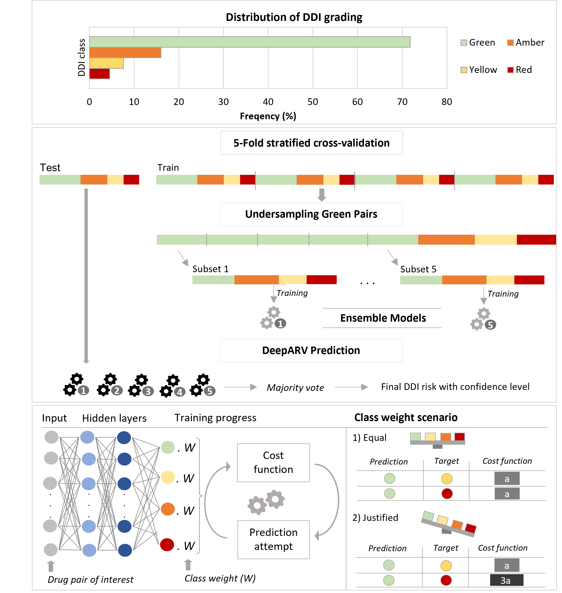
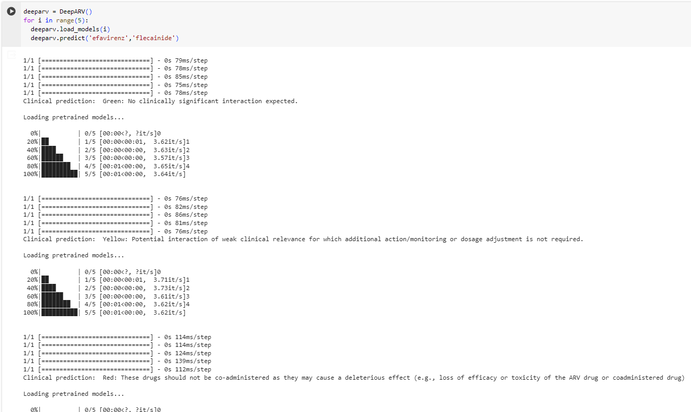

# DeepARV: Ensemble Deep Learning to Predict Drug-Drug Interaction (DDI) of Clinical Relevance with Antiretroviral Therapy (ARV)

Due to the importance of DDIs throughout drug development and for the clinical management of people living with HIV, efficient computational methods for predicting DDI risks are in need. We propose a deep learning approach called DeepARV that builds on the University of Liverpool HIV Drug Interaction database (https://www.hiv-druginteractions.org/) to predict the risk of DDIs between ARVs and commonly used comedications using the concept of molecular drug structural similarity.

#### Link to the paper: https://www.nature.com/articles/s41540-024-00374-0

### Dependency
- rdkit-pypi version 2021.09.3
- pubchempy version updated March 2019
- tensorflow version 2.12.0

### Codes and data availability
- The constructions of both models, DeepARV-Sim and DeepARV-ChemBERTa, are available at notebooks namely, 'DeepARV_Sim_construction_revised.ipynb' and 'DeepARV_Chemberta_construction_revised.ipynb', respectively.

- The evaluation of their performance is available at 'DeepARV_Sim_evaluation.ipynb' and 'DeepARV_Chemberta_evaluation.ipynb'.

- Trained models are available at https://drive.google.com/drive/folders/1tCzeQrZ8TiwtFk-dEg5tUO6v9dOdk6n6?usp=drive_link.

- Label of DDI risks between ARVs and comedication is available at https://www.hiv-druginteractions.org/.

### Usages
Find DeepARV_Sim_PubChemAPI and DeepARV_Chemberta_PubChemAPI files for example. Given a drug pair between ARV and a comedication of interest, our trained DeepARV-Sim or DeepARV-ChemBERTa will ouput the DDI clinical risk via 5 iterations. 

### Contact
Please feel free to contact me for any questions.

Email: thao.pham@liverpool.ac.uk
#### Please cite us if you find this study helpful
