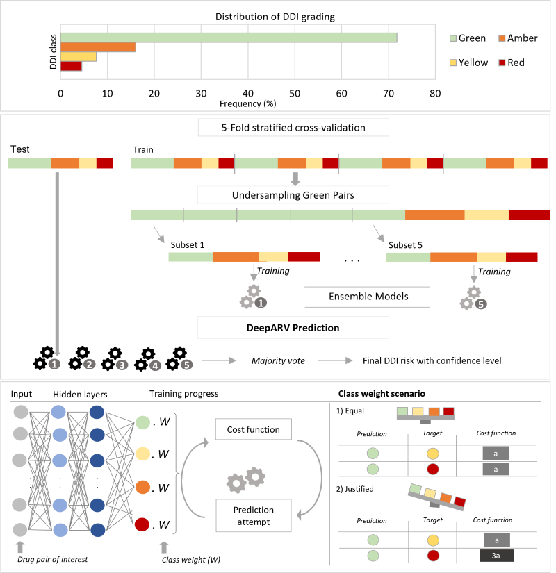

# DeepARV: Ensemble Deep Learning to Predict Drug-Drug Interaction (DDI) of Clinical Relevance with Antiretroviral Therapy (ARV)

Due to the importance of DDIs throughout drug development and for the clinical management of people living with HIV, efficient computational methods for predicting DDI risks are in need. We propose a deep learning approach called DeepARV that builds on the University of Liverpool HIV Drug Interaction database (https://www.hiv-druginteractions.org/) to predict the risk of DDIs between ARVs and commonly used comedications using the concept of molecular drug structural similarity.

### Dependency
- rdkit-pypi version 2021.09.3
- pubchempy version updated March 2019
- tensorflow version 2.12.0

### Codes and data availability
DeepARV includes pre-trained model and evaluation.
DDI risks between ARVs and comedication is available at (https://www.hiv-druginteractions.org/).

### Usages
Find DeepARV_API file for example. Given a drug pair of ARV and comedication of interest, our pre-trained DeepARV will ouput the DDI risk with confidence level. 

### Contact
Please feel free to contact me for any questions.

Email: thao.pham@liverpool.ac.uk
